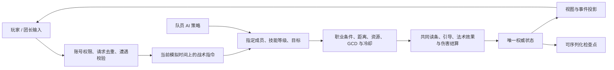

# 战斗引擎：经典规则、实时指令与未来多人边界

> 历史实现/测量记录：2026-10-01 已删除浏览器模拟 Worker、接管和检查点上传。文中旧本地脚本与性能结果不适用于当前服务器架构；当前边界见 [客户端与服务器模拟边界](client-simulation-boundary.md)。

研究日期：2026-09-26；验证记录更新：2026-09-28。目标版本沿用 [2019 Classic Phase 1](../design/version-baseline.md)，以固定的 1.12 社区资料辅助校验。此文区分已实现行为、研究结论与后续工作，不宣称与暴雪服务端完全等价。

## 决策

2026-09-28 后续决策：用户提出拆分策略 Worker、按 GCD 降低决策频率及更高效传输后，确定下一阶段采用 [战斗与策略分离设计](combat-policy-architecture.md)。该文现已记录已接入的统一动作、低频调度、双 Worker 和增量传输。下述“本轮实现”与旧性能表保留为此前输入改造记录，最新验证以该设计文末为准。

保留现有 JavaScript 确定性模拟核心、100ms 规则步长和浏览器 Worker。针对输入与施法边界做重构，不更换渲染引擎，不把当前规则移植成 C++，也不为了 40 个玩家实体引入分布式战斗或 ECS 全量重写。

上一轮实验显示重复属性计算可以大幅优化，但那是当时的工作区快照。**本轮当前版本复测未达到 40 人实时预算，不能沿用旧结果宣称当前已具备余量。**保留规则核心的依据是其确定性与可复用边界，而不是已经完成性能验收。另一个正确性风险是同一技能从 AI、玩家、团长口令进入时，选择策略与合法性校验混在一起，导致手动施法仅支持部分法师法术、治疗被重新选目标、团本救急技能绕开普通执行路径；本轮先消除这条输入路径的分歧。

每个遭遇始终只有一个状态写入者。当前单账号队伍可由 Worker 运行；未来多人场景由服务端持有同一个核心，客户端只提交意图、显示结果。不会用客户端自行算出的伤害或上传的整份状态作为多人权威结果。

## 开源调研与取舍

### World of ClaudeCraft

研究提交 `cecebab4da06287351b37e118c630c185717b81c`，项目为 [levy-street/world-of-claudecraft](https://github.com/levy-street/world-of-claudecraft/tree/cecebab4da06287351b37e118c630c185717b81c)。其维护文档自称 classic-style micro-MMO；本次没有测量其实际在线人数或服务器承载量。

- [架构约定](https://github.com/levy-street/world-of-claudecraft/blob/cecebab4da06287351b37e118c630c185717b81c/CLAUDE.md)描述同一无 DOM 的模拟代码运行于浏览器、服务端和无界面环境，固定 20Hz，随机数集中管理；渲染通过公共世界接口读状态。
- [施法生命周期](https://github.com/levy-street/world-of-claudecraft/blob/cecebab4da06287351b37e118c630c185717b81c/src/sim/combat/casting_lifecycle.ts)显式处理技能学习、目标、控制、GCD、队列与施法完成；[队列与挥击顺序](https://github.com/levy-street/world-of-claudecraft/blob/cecebab4da06287351b37e118c630c185717b81c/src/sim/combat/queued_cast_swing_yield.ts)还专门处理连续施法饿死普通攻击的问题。
- [服务端](https://github.com/levy-street/world-of-claudecraft/blob/cecebab4da06287351b37e118c630c185717b81c/server/game.ts)有兴趣范围、快照与性能统计边界。对我们有价值的是职责划分和测量方法。其大量自定义职业机制不适合作为原版 WoW 数值或机制的判定标准。

### CMaNGOS Classic

继续采用现有数据基准提交 `8ec338a1704e7dcb1c0213eb7ed58f9231ade40f`，避免拿另一个最新分支的行为与当前数据混用。

- [SpellHandler.cpp / HandleCastSpellOpcode](https://github.com/cmangos/mangos-classic/blob/8ec338a1704e7dcb1c0213eb7ed58f9231ade40f/src/game/Spells/SpellHandler.cpp)：从会话确定施法者，验证是否掌握主动技能，再读目标；客户端提供目标不等于客户端决定结果。
- [Spell.cpp / CheckCast、cast、TakePower、TakeReagents](https://github.com/cmangos/mangos-classic/blob/8ec338a1704e7dcb1c0213eb7ed58f9231ade40f/src/game/Spells/Spell.cpp)：施法开始与完成有不同检查时机；控制、射程、资源、弹道及触发法术有明确语义。

它是社区参考核心，不是暴雪源码。这里只借鉴边界并对照行为，没有复制其实现代码；同样不能把通过本地测试当成官方实测一致。

### WoW 为什么能处理 40 人战斗

玩家的输入频率、规则处理、网络状态同步和客户端绘制不需要同频。每帧重新计算所有法术、装备和 UI 并不是必要工作。40 名玩家还会产生宠物、图腾、光环与范围目标，所以要控制的是整条热点路径与状态广播的工作量。

暴雪的[法术批处理说明](https://us.forums.blizzard.com/en/wow/t/spell-batching-in-classic/137118)明确区分了不同优先级的消息循环，并举例同一批中的拳击与变羊可以同时生效。它没有公开完整服务器实现，因此不能据此断言暴雪使用我们选定的数据结构或 tick 频率。**100ms tick、20Hz 网络输入、2019 经典服批处理语义和 60FPS 画面是不同的指标。**

## 本轮实现

- `combat-command.js` 的 PvE 指挥入口不再限定五人副本，支持野外、小队和团队规模；`raidCommandView` 移除恰好 25 人的展示限制。
- `combat-input.js` 明确维护可执行的技能族与目标类型。支持九职业的伤害、治疗、驱散和部分防御技能；UI 只列出成员实际学会且入口支持的技能。资料库中的其他技能不会被自动当作已支持。
- 指定施法是一次战术命令：保留准确等级和目标，覆盖 AI 的治疗阈值、自选目标、预留冷却和转火偏好。职业限制、射程、资源、技能 CD、GCD 等仍有效。普通 AI 继续使用其原有策略。
- 一名成员最多保留一条待施法命令；新命令替换旧命令。最多等待当前读条/GCD 5 秒，在可行动的规则 tick 执行前重新校验；技能仍在冷却、资源不足或目标不合法会明确失败。这是项目的战术命令缓冲，**不是 WoW 客户端短施法队列的复刻**。
- 指令记录有遭遇内递增序号、接收与到期的模拟时间、成员、技能、目标和执行反馈。近期反馈最多保留 40 条；全量历史不是无界地塞进每帧快照。
- 指令“已开始”表示进入真实施法流程；读条仍可能被打断、目标可能移出距离，命中仍可能失败。成功伤害/治疗由原有战斗日志表达，不能把接收指令当作技能命中。
- 停止施法取消该成员的待执行命令、读条和下一击队列，保留已经启动的 GCD。停火取消新伤害与未释放的伤害读条，包括宠物；已有 DoT、地面效果和飞行中的弹道继续结算，治疗继续执行。
- 团本点名转火覆盖输出成员的脚本默认目标，坦克保留接怪分工。切回原团本“首领/小怪”口令会清除临时点名集火。
- 团本盾墙、圣疗、激活走同一直接施法入口；救急口令明确中断旧读条，失败恢复旧读条。原有真实资源、技能效果与冷却仍由共同执行器处理。
- Worker 与服务端均接受团队施法入口。服务端继续使用既有请求去重、角色归属、实例事务、代际失效与回放重算。跨账号不能强制施放另一人的技能；友方施法目标不是受控制角色，合法治疗允许指定队友。多账号共享战斗拒绝暂停。
- 界面新增可折叠的“指定技能与目标”，使用统一 GameSelect；大队伍的受令成员选择也使用 GameSelect，避免展开几十个成员按钮遮挡战场。

## 准确性边界与后续优先级

现有 [战斗规则](combat-rules.md)、[技能运行时](spell-runtime.md) 和 [团本校准](raid-calibration.md) 仍是准确性清单。本轮提高的是输入与现有结算的一致性，不是补齐所有 WoW 规则。

| 层面 | 当前状态 | 下一步的验收依据 |
| --- | --- | --- |
| GCD、等级链 CD、普通读条成本、引导成本 | 已有共同时间模块与边界测试 | 增加来自固定版本的事件时间线 |
| 输入目标与等级、取消、恢复、重复请求 | 本轮加入行为回归 | 任意切分推进与保存恢复得到相同结果 |
| 命中、抵抗、护甲、系数、仇恨 | 现有社区参考实现与部分测试 | 固定向量、统计区间、可追溯实测；不能只看一场 DPS |
| 控制期间可用技能、所有光环/触发例外 | 未完成逐技能校准 | 以免疫/取消控制属性建立例外测试，不能一概推断 |
| 时间分辨率 | 仍以 100ms 检查多数战斗期限 | 若需求是精确到毫秒的竞技复刻，应拆出事件期限调度；不能仅提高渲染帧率 |
| 2019 批处理、法术队列、网络延迟 | 尚未复刻 | 独立的规则版本配置和可重复输入场景 |
| 下一击技能的指定目标、宠物单独手动施法、任意地面点施法 | 不在本轮指定技能入口中 | 先定义各自目标和时序契约，再开放 UI |
| 团本人数与数值 | 正式玩法仍为现有 25 人设计，40 人是容量夹具 | 原始 40 人数值与项目缩放必须作为不同配置校准 |
| 真正多人联机 | 本轮未实现 | 服务端独占状态、可信输入时间/序列、防重放、断线重连与投影带宽压测 |

精确事件调度不要求把所有 AI 与空间判断一并提升到高频。未来可以让读条完成、挥击、周期效果和弹道按截止时间处理，而 AI/空间决策保留较低固定频率。但当前大量机制以 tick 顺序定义行为，贸然把 `100` 改成 `50` 或引入总堆会改变结果，必须先建立更完整的事件轨迹基准。本轮没有以重写时钟替代准确性研究。

未来联网时应按副本分配独立模拟所有者，同一副本内保持单写入、确定顺序。网络层再做加入快照、按观察者投影的增量状态、输入确认与重连恢复；不直接广播现在包含大量展示元数据的完整 Worker 帧。单机 Worker 的整状态检查点接口不能复用为不可信多人写入接口。

## 验证

新增 `packages/game-domain/test/combat-input.test.mjs` 覆盖九职业代表技能、精确等级与治疗目标、GCD 等待、替换、取消、死亡/距离/资源/沉默/控制/学派封锁、40 人转火与记录上限、JSON 恢复以及不同推进粒度。服务端测试覆盖重复请求、外部账号归属和共享时钟保护。原有小队指挥、团本口令、职业规则、回放和 Worker 测试共同验证调用方。

暴风雪旧测试的 `7 !== 8` 已定位：固定种子下第一个目标的第七跳被抵抗，第八跳正常发生。修正为检查八个时间点上的伤害或未命中结算，不删除抵抗、不提高命中率，也不把八次成功伤害当成八次结算的定义。

最终定向回归：`node --test --test-concurrency=1 packages/game-domain/test/combat-input.test.mjs packages/game-domain/test/combat-command.test.ts apps/web/test/local-simulation-client.test.mjs apps/web/test/local-simulation-worker.test.mjs`，51/51 通过。此前小队指挥、经典职业规则及团本口令组合 44/44 通过；策略场景与输入/服务端组合 39/39 通过。这些组合存在重叠，不相加为独立用例总数。`npm run check`、`npm run data:compile` 通过；没有把全仓库历史失败表述成全部通过。

最终根目录 `npm run typecheck` 通过。此前前端独立类型检查仍报告 `classic-action-bar.tsx` 四处既有隐式 any，未将其算作通过。

### 最新容量复测：尚未验收

Apple M4、Node 24.15.0，40 人合成队伍，每场预热后测一次，模拟 15 秒，包含规则、战斗投影、复制、团务视图和检查点：

| 场景 | 总墙钟 | 进程 CPU | 规则 tick P95 | 单帧 JSON 大小 |
| --- | ---: | ---: | ---: | ---: |
| 卢西弗隆 | 21.47 s | 16.24 s | 167.02 ms | 1,471,104 bytes |
| 管理者 | 23.37 s | 15.35 s | 203.15 ms | 1,527,105 bytes |

两场均超过实时预算。卢西弗隆测量期间本任务没有并行测试或预览；管理者后段启动了预览服务，因此第二场不能视作隔离样本。桌面还有其他应用负载，工作区也包含其他任务的规则与展示变更；不能把相对旧基准的差异全部归因于本轮输入实现，也不能把它全部归因于环境而忽略。原始样本和源码哈希保存在 [容量复测 JSON](../research/combat-input-capacity-2026-09-28.json)。上一轮基准仅作为历史记录，见 [40 人容量优化](raid-capacity-optimization.md)。

短区间 CPU 采样仍出现派生属性依赖遍历、法术属性/天赋求值、状态复制与垃圾回收热点；采样也包含初始化，不能当作纯战斗占比。下一轮性能工作应在固定源码与安静环境中拆开规则、投影和传输测量，减少重复求值与完整展示数据复制，再验收持续战斗的 P95/P99 和积压。当前兆字节级 Worker 帧尤其不应直接作为未来多人网络包。

### 浏览器检查：仅完成界面检查

已实际打开生产战斗界面的指令区域，用 GameSelect 选择治疗成员、次级治疗术和盾卫，并检查截图布局。但本地 Worker 启动/恢复失败，未观察到命令执行回执；之后浏览器自动化超时，因此**端到端浏览器交互未通过验收**。这不由领域测试代替。已修正预览工具的 `PREVIEW_COMMAND_ONLY` 模式，避免创建并每秒推进无关团本；增加 Worker 加载失败的开发控制台诊断。尚未证明这个修正解决了全部启动问题。

交付状态：架构研究与统一实时输入实现已完成，规则层与服务端行为已有回归证据；40 人稳定实时性能、完整浏览器交互和完整 WoW 准确性仍是明确未完成项。
