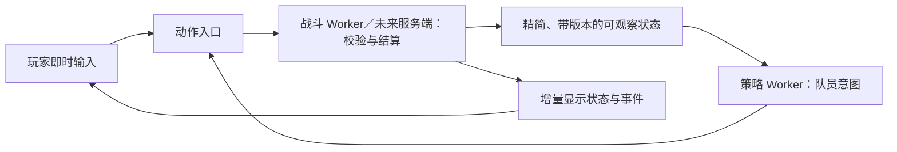

# 战斗结算、策略决策与传输边界

> 历史实现/测量记录：2026-10-01 已删除浏览器模拟 Worker、接管和检查点上传。文中旧本地脚本与性能结果不适用于当前服务器架构；当前边界见 [客户端与服务器模拟边界](client-simulation-boundary.md)。

日期：2026-09-28。状态：已接入统一动作入口、200ms 策略调度、300ms 候选技能队列、独立策略 Worker 和二进制增量帧。实现与验证见文末；仍使用 100ms 规则步长，未引入历史批处理或共享内存。

## 决策

拆成战斗核心和策略核心。策略读取可观察状态，输出动作意图；战斗核心拥有唯一可变战斗状态，判断动作是否合法并结算。默认本地部署目标为一个战斗 Worker 和一个策略 Worker；一个策略 Worker 批量管理本客户端负责的角色，不为 40 名队员各开一个 Worker。领域模块本身不依赖 Worker API，支持无界面测试和服务端运行。

先完成模块解耦与决策节流，再接入第二个 Worker。新增线程不能作为性能改善的证明，必须同时比较总 CPU、复制成本、积压与输入延迟。弱设备可以使用同一 Worker 内的两个模块；这只是部署适配，不维护另一套战斗规则。

## 职责与未来多人部署

战斗核心处理学习/装备/姿态/资源/距离/视线/GCD/CD/控制等硬条件、施法生命周期、命中抵抗、伤害治疗、仇恨、普通挥击、周期效果、弹道和移动积分。策略负责选目标、选技能、治疗优先级、打断选择、移动目的地和主动取消读条。策略可以作近似估算，也可以提交因观察过时而不再合法的动作；战斗核心必须拒绝非法执行，不能相信策略已检查过。

原 `decideClass`、`decideCompanion`、`decideMage` 已拆为只读 `selectClass`、`selectCompanion`、`selectMage` 和共同动作入口 `executeCombatIntent`。完整策略动作不受人工施法 UI 的有限白名单限制。策略保护导致的主动取消使用独立 `cancel` 意图；读条完成路径只做结算校验，不再调用 `strategyAllows`。

未来每位玩家的客户端运行自己的策略；NPC 队员策略可授权给团长客户端，断线后迁至服务端的策略宿主。NPC/Boss 行为不会因此消失：敌人 AI、遭遇脚本及机制触发仍由服务器可信执行。服务器还须做输入权限、去重、节流、连接与状态同步，因此“只运行战斗引擎”应理解为不必重复运行所有玩家的决策逻辑。

每名受控角色只有一个有效控制者，使用带代际的控制租约；交接后旧代际的输入失效，避免团长和服务器同时驱动 NPC。掉线时不能无限重复最后一次技能请求；已开始的合法施法、普通攻击和效果由结算核心继续处理，后续决策由指定回退策略接管。观察数据仅包含允许该控制者知道的信息，不把隐藏 Boss 计划、其他玩家私有策略或全量存档交给客户端。

客户端策略频率不是安全边界。若未来需要防止修改客户端获得反应优势，服务器必须执行相应的托管策略节奏，或将公平性关键策略放在服务器上；普通手动操作仍按技能规则验证。

## 调度：降低决策频率，保持结算正确

以下为项目的初始调参值，不是 WoW 官方频率或已测得的人类反应常数：

| 路径 | 初始策略 |
| --- | --- |
| 常规输出/选目标 | 最多每 200ms 完整评估一次；无可行动窗口时睡眠 |
| GCD/长读条期间的下一个 GCD 技能 | 在实际释放窗口前约 300ms 唤醒，选择一条候选动作 |
| 治疗危急、敌人读条、目标死亡、团长转火 | 标记相关角色需要重新决策，按反应期限唤醒，合并重复事件；不每个事件重扫全团 |
| 不受 GCD 限制的技能、取消读条、移动意图 | 独立的反应通道，不能被常规输出的 GCD 睡眠一起关掉 |
| 人工停火、取消、指定技能 | 直接走动作入口，不附加 AI 的人为反应延迟；仍服从合法性和动作时序 |
| 普通攻击、已开始的施法/引导、DoT、HoT、弹道、移动积分 | 由结算核心持续推进，不依赖策略是否醒来 |

例如 1.5 秒 GCD 的普通输出，可以在前约 1.2 秒不扫描整套技能，最后约 300ms 准备下一动作。真正的唤醒时间还须考虑当前读条、技能独立/共享 CD、资源恢复和不同技能的 GCD 类别，不能硬编码“所有角色每 1.5 秒行动一次”。治疗策略也不必持续排序全团，主要使用相关生命/减益变化事件，并保留有限频率的兜底检查。

唤醒期限使用模拟时间；错开角色的常规评估相位，避免每 200ms 出现全团尖峰。紧急事件应合并且保留原来的最早到期时间，不能不断重置反应计时而饿死动作。需要随机反应差异时使用独立、可保存的策略随机流，不能消耗伤害/命中的随机数。先提供固定节奏验收，再增加人格或水平参数。

战斗模拟不能等待策略 Worker 回包。迟到结果按权威接收时刻处理，不把客户端时间戳当作过去已生效的动作；拒绝过期遭遇、旧控制代际和重复序号。记录观察版本与接收后的规范化输入时间线，回放该输入流来验证战斗确定性。不能承诺不同机器上异步 Worker 的实际调度天然生成相同输入流。

## 数据：先精简，再二进制

当前 `local-simulation.worker.ts` 使用 `postMessage` 传对象，浏览器使用 structured clone；不是每帧 `JSON.stringify/parse`。容量脚本的 `frameBytes` 是 JSON 表达大小，只能作为数据量指标，不等于 Worker 真实复制字节数或网络包大小。[MDN structured clone](https://developer.mozilla.org/en-US/docs/Web/API/Web_Workers_API/Structured_clone_algorithm)

原帧投影重复包含成员状态、展示 actors、装备、已学技能、属性描述和日志。新的直播投影用 actor 表和 ID 引用消除成员重复，属性描述按秒刷新，日志独立发送；团务视图的未变内容由增量协议保留在接收端。历史回放投影仍生成独立完整快照。

采用三个数据通道：

1. 低频元数据：角色/模型/名称/装备外观/技能定义，初始化或变化时发送，允许普通对象。
2. 高频状态：实体编号、生命/资源、位置、施法与冷却截止时间、变化的光环，使用字段掩码和增量。策略观察与 UI 投影分别设计，策略不接收图标、文本说明、装备背包或旧日志。
3. 有序事件与输入回执：只发新增事件，带序号；保留有界历史与缺口恢复，不把完整日志塞入每帧。

高频数值使用带协议版本的 `ArrayBuffer`/TypedArray，Worker 之间通过 transfer 转移所有权。使用有界缓冲池并回收已消费缓冲区；转移后发送者不能继续访问原缓冲区。两个消费者不能同时持有同一个已转移缓冲区，因此策略与渲染各有精简投影与缓冲区。[MDN transferable objects](https://developer.mozilla.org/en-US/docs/Web/API/Web_Workers_API/Transferable_objects)

显示位置允许量化和插值，但不修改权威结算精度；实体 ID、事件序号和时间戳的表示须有明确范围，不能盲目用 Float32 保存所有数值。队列需要背压：可合并尚未发送的显示状态，不能丢失输入、执行回执和战斗事件。增量包包含基线/序号，基线不匹配时重取快照；不能任意丢中间增量。SharedArrayBuffer 暂不采用，先避免共享可变内存同步的复杂度。

## 批处理、施法队列和网络延迟的选择

- **默认不加入历史 400ms 批处理。** 当前内容与技能数值仍以 2019 Classic Phase 1 为基准；交互时序采用明确标注的项目响应模式，不能称作严格的 2019 时序复刻。以后只有在需要历史对照且具备逐场景测试时才引入经典批处理配置。把 tick 改成 400ms 不等于复刻批处理。
- **增加短施法队列。** 初始计划窗口 300ms，提前准备的一个 GCD 动作在合法时机尝试执行，执行时再次校验；新候选可替换旧候选。这是初始产品参数，不声称与原版默认值一致。它与当前最多等待 5 秒的“团长战术请求”是两层：战术请求可以持续等待，实际技能请求只在短窗口入队；不能把 5 秒当作 WoW 施法队列。
- **不在正常单机玩法里伪造网络延迟。** 延迟、抖动、丢包/断连放在联网测试适配器；未来输入以服务器接收与排序为准。真实玩家按钮不额外叠加机器人反应时间。
- 当前 100ms 规则步长仍限制响应精度。不加入 400ms 人工批处理不代表已经做到零延迟或 10ms。下一阶段可把读条完成、GCD、挥击、周期效果等按期限调度，AI 保持低频；必须有同时间事件顺序、取消与恢复测试，避免只把固定 tick 调小。

暴雪的 [2019 说明](https://us.forums.blizzard.com/en/wow/t/spell-batching-in-classic/137118)描述同一批内拳击与变羊可能同时有效；[1.13.7 PTR 公告](https://eu.forums.blizzard.com/en/wow/t/wow-classic-version-1137-ptr-is-now-available/240640)明确将测试批窗口从 400ms 减到 10ms，并提示技能行为可能受影响。因此批处理是会改变战斗结果的版本语义，不能混同于性能优化或画面帧率。

## 实施顺序与验收

1. 建立可只读决策、可独立执行的统一动作契约，提取全部当前 AI 调用方；保留规则行为测试，并新增非法/过时意图的无副作用拒绝测试。
2. 在同一线程先实现按期限唤醒、事件合并与 GCD 窗口，分别统计策略调用数、规则耗时和结果变化。策略故意引入反应延迟会改变 DPS/治疗结果，不能要求与旧的高频 AI 战斗哈希相同；应要求同一已接收动作序列的结算可重放。
3. 精简投影与新增事件流，再实现二进制动态增量；验证重取基线、乱序/重复包、缓冲区复用与消费者背压。
4. 接入策略 Worker，通过 MessageChannel 直连战斗 Worker；测量总 CPU 与端到端输入延迟。无界面适配器使用相同契约运行容量测试，未来战斗核心可迁入服务端。

目标验收场景包括 40 人、宠物/图腾、多个敌人、持续范围效果、密集治疗与指令中断，确保整个采样区间持续战斗。初始性能目标为 100ms 推进片段 P95 < 50ms、无持续时间积压；本地人工输入至接受/拒绝反馈 P95 < 200ms。普通稳态动态增量以每包 20KB 以下为优化目标（不包含首次快照和单独事件流），并测实际复制/传输字节。这些是验收目标；本次容量测量与边界见文末，不能从无界面测量推断浏览器 GPU 帧率。

总性能收益必须包含策略 Worker、战斗 Worker、编码/投影、传输和 UI 消费，不能只展示战斗 Worker 变快。现有 profile 混有初始化与规则求值，尚不能给出可信的“策略占总 CPU 百分比”，因此本设计不承诺拆分后固定倍数的提升。

## 已接入的实现

- `packages/contracts/src/combat-policy.ts` 定义动作、请求和回执；`combat-policy.js` 保存模拟时间唤醒期限、控制租约代际、输入序号和单条候选技能。
- 每 200ms 最多常规评估一次，角色相位错开；普通 GCD/长读条在结束前 300ms 准备候选。独立反应检查不随 GCD 休眠关闭，危急生命、可驱散减益、目标死亡、敌方读条和集火变化合并唤醒。选目标、移动、取消、药水、种族反应、职业技能和宠物主动技能均通过只读选择与权威执行分开处理。
- 人工施法可在最后 300ms 替换候选；团长指定技能仍保留原 5 秒战术等待。人工停止、停火、转火与接管会废弃旧候选和旧代际策略回包。已接受技能的挥击、施法、周期效果、弹道与移动继续由规则 tick 推进。
- `combat-observation.js` 使用字段白名单；不发送存档、背包条目、日志、未来刷怪或 Boss 计划。已拥有技能、装备数值来源和当前增益用于相同规则的近似估算，消耗品和材料仅发送可用数量。当前宿主管理本地队伍；未来跨账号部署仍须在服务端授予租约和裁剪各控制者观察范围。
- 浏览器由 `local-simulation-client.ts` 创建战斗与策略两个 Worker，通过 MessageChannel 直连。策略批量提交结果，模拟不等待回包；500ms 模拟时间内未收到结果或 Worker 报错时更换代际并回到同线程模块。竞技场临时战斗上下文保存各队的策略调度状态，使用同线程规则模块。
- `combat-stream.js` 将高频数值编码为带版本、基线、序号的 ArrayBuffer：字段路径由 uint32 索引定位，每组 32 字段用位掩码，数值使用 Float64 保留时间与位置精度。变更的非数值字段和路径字典使用结构化元数据。首次快照不受稳态包大小目标约束。
- 每个消费者只允许一份状态包在途，确认前合并显示更新；接收方通过 transfer 归还缓冲区，最多保留两个 1MB 以下的可复用缓冲区。策略与显示各有自己的投影、基线、序号和缓冲池。接收端按路径复制变更对象，已交付 React 的旧帧不会被修改。重复包忽略，基线缺口重取单调递增的新快照。
- 日志只发送新增 ID，确认后才推进已消费游标；超过战斗日志的有界历史时明确标记缺口并恢复到当前保留窗口，不伪称完整历史。动作回执有界保留，规范化策略输入保留最近 2048 条；长程回放需要调用者持续归档输入，不能只依靠一次最终检查点。
- `replayCombatIntent` 按权威 `receivedAt` 重放同一动作序列，禁止策略重新生成输入。测试覆盖不同推进分段后的结算一致性；异步 Worker 在不同机器产生的输入序列仍可能不同。

### 验证入口

- `packages/game-domain/test/combat-policy.test.mjs`：只读决策、观察等价、硬拒绝、过时输入、代际交接、唤醒合并、短队列、独立反应及确定性回放。
- `packages/sim-core/test/combat-stream.test.mjs`：Float64 精度、增删字段、乱序/重复包、基线恢复、实际 buffer 转移、缓冲池和不可变旧帧。
- `apps/web/test/local-simulation-{worker,client}.test.mjs`：输入反馈、背压确认、会话重启、检查点、故障与恢复。
- `node scripts/benchmark-combat-policy.mjs --duration=30000`：运行生产 Worker 入口，使用真实 MessageChannel/transfer，对照同线程与双 Worker。默认构造 40 人、多敌人卢西弗隆容量场景，敌人生命乘 100 保证采样不中途胜利；不修改伤害与技能规则。总进程 CPU 包括两个 Worker 和接收消费，不含 GPU。数值缓冲区计实际 transfer 容量；非数值结构化元数据同时报告 V8 编码大小作为代理，不能称作浏览器实际复制字节。

100ms 截止时间精度、历史日志窗口外的完整归档、真实多人权限与网络公平性、浏览器 GPU 验收仍是明确边界。本改造不宣称实现严格的 2019 批处理时序。

### 2026-09-28 验证记录

相关职业、施法、策略、宠物、种族、指令、客户端与传输回归共 **231 项通过**；随后针对暂停拒绝与代际失效补验，聚焦测试 **57 项通过**（与前者有重叠，不相加）。两个生产 Worker 已通过 `platform:browser` 打包；前端 TypeScript 检查、JavaScript 语法检查、规则数据清单检查均通过。

仓库根类型检查另有其他工作中的错误：`gold-auctions.test.ts` 的 `lotId` 参数，以及 `item-bis.test.ts` 的三个隐式 `any`。这些测试不属于本次改造，当前不能把全仓类型检查标记为通过。

同一 40 人多敌人场景分别运行 30 秒，两个模式全部采样均处于战斗、最少存活人数均为 40。原始结果保存于 [combat-policy-performance-2026-09-28.json](../research/combat-policy-performance-2026-09-28.json)。这是生产 Worker 的 Node 无界面适配器测量，接收端包含解码与帧还原，未包含 React 提交或 WebGL/GPU 绘制。后台桌面任务会影响墙钟延迟；单次结果不构成固定加速比。

| 指标 | 同线程策略 | 独立策略 Worker |
| --- | ---: | ---: |
| 总进程 CPU（ms） | 7296.6 | 9038.6 |
| 推进调用 P95（ms） | 22.7 | 18.4 |
| 人工输入反馈 P95（ms） | 16.6 | 18.6 |
| 显示数值 buffer 传输容量 P95（字节） | 1472.0 | 1440.0 |
| 显示结构化元数据 V8 大小 P95（字节，代理值） | 6567.0 | 7308.0 |
| 结束时积压（ms） | 10.0 | 31.0 |
| 最后 100 次采样积压 P95（ms） | 19.0 | 51.0 |

双 Worker 收到 6359 个角色决策请求，没有策略错误或超时回退；策略通道另发送 274 个数值 buffer，合计 383912 字节，最大 1560 字节。这个传输计数不包含初始对象基线、非数值元数据与返回意图；不把它当作全通道总流量。

本次双 Worker **总 CPU 增加约 24%**。推进调用 P95 下降，但输入反馈 P95 略高；拆分实现了调度隔离，并没有证明节省总算力。推进调用包含不足一个规则 tick 的轮询以及投影/编码，并非纯 100ms 规则结算耗时。两者都有启动或偶发尖峰（最大推进调用分别约 502ms、459ms），不能只凭 P95 宣称所有帧达标；本轮结束积压较小，末段未呈持续增长。下一轮浏览器验收仍需分别量出实际规则 tick、React 和 GPU，以及更长时间的稳态。
