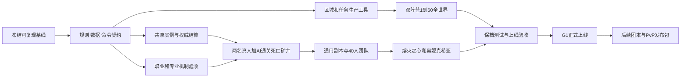

# wow-sim 1—60 级上线总规划

> 2026-09-16；项目设计与交付规划，不表示其中功能已实现。本次只新增规划文档，未启动开发、迁移、提交或发布。
> 用户已确认：分阶段上线；首次正式上线包含 1—60 级、双阵营全地图、真人组队和首批团本，其余团本逐期开放。

## 阅读与执行入口

1. [现状审计](audit.md)：源码、历史任务、测试和缺口。
2. [内容范围与完成标准](content-matrix.md)：全部区域、职业、副本、团本与开放阶段。
3. [开发工作分解与排期](backlog.md)：任务编号、依赖、交付物、验收和前两周安排。
4. [Codex 并发操作手册](codex-playbook.md)：工作区、任务模板、接口契约、合并与复核。
5. [双类型 AI 队友设计](../../specs/2026-09-16-companion-models-design.md)：单本佣兵、长期伙伴、每角色任务装备、个人双专业与实时外派；文内区分用户要求和建议，未实施。
6. [最终产品架构评估](../../specs/2026-09-16-target-architecture-review.md)：当前源码问题、响应体实测、目标实体/执行/经济模型及重构顺序；技术调整以该最新评估为准。

本文件是项目级范围和决策入口；backlog 是交付索引。具体代码任务在进入 Ready 前再编写子系统实施计划，绑定当时的代码提交及接口版本，避免现在为数月后的代码虚构逐行修改。

## 1. 项目判断

项目已经越过“只有模拟基础库”的阶段：存在可玩的单人冒险、AI 队伍、死亡矿井、网页交互和服务端存档。但它仍是持续变动中的垂直原型，不是完整 1—20 世界，更不是可发布的 1—60 联机产品。

最关键的四条主线是：

- 将单玩家存档拆出账号、角色、共享队伍、实例、物品与交易的权威边界。
- 将当前集中在 catalog 和特例脚本中的内容，变成可独立生产和验证的区域、任务、遭遇数据包。
- 让九职业与专业的“目录完整”变成“机制有效、获取可达、阶段正确、全流程可玩”。
- 建立冻结基线、隔离开发、自动验收、灰度发布、存档恢复的交付体系。

不能用导入记录数量、测试数量或某个任务的“已完成”代替整合版验收；也不宜现在把代码整体重写。

## 2. 产品与上线边界

### 核心体验

手机浏览器中的 2D 魔兽冒险模拟器。玩家选择路线、培养角色、配置技能优先级和队友策略，系统自动执行战斗。单人可用 AI 补位，朋友可真人组队；团本依赖角色职责、配装和机制决策，而非只比较战力。

主要循环：准备与训练 → 旅行/任务/采集 → 战斗和掉落 → 装备与专业成长 → 五人本 → 满级准备 → 团本与社交。

不把每一个原版动作改成点按钮，也不把每一场遭遇简化为等进度条。2D 改编保留射程、站位区、威胁、打断、驱散、目标切换和职责分工；机制必须可观察、可解释、可配置。

### 版本与既有玩法决定

保留现有 2019 Classic/1.12 参考方向，新增独立的 `rulesetVersion`、`contentPhase`、`adaptationProfile` 和 `dataVersion`。首发规则与后续内容开放分别管理；不混入 TBC、探索赛季或周年服特有规则。

保留已经得到用户指示或现有任务采用的改编，并显式登记：20 级普通坐骑、自动战斗、离线野外活动、AI 队友、专业便捷操作。现有专业实现采用不限专业数量；用户最新要求改为主角与每名长期伙伴各自双主要专业、个人专业收益及实时外派采集，后续实施以最新要求为准。按熟练度自动解锁、远程固定价补料及合成附魔卷轴等便捷方向继续纳入阶段和经济校验。它们不是原版一致性证据。

当前 AGENTS.md 明确不要求兼容旧存档、旧接口或旧数据，重构时直接更新所有消费者并重建开发数据，不建设兼容层或存档迁移。未来正式保档运行需要在发布前另行明确政策；当前不得以未来可能保档为理由增加历史兼容工作。

### 首次正式上线 G1

| 维度 | 必须交付 |
|---|---|
| 世界 | content-matrix 中的两大陆 40 个野外区域、6 座主城及交通网络；区域可进入、可活动、可正常离开；阶段相关事件允许锁定 |
| 成长 | 9 职业、8 种族及全部合法组合；阵营正确的出生地；1—60 连续升级与装备来源；技能、天赋、职业任务、宠物与种族机制 |
| 内容 | 每个区域中属于首发清单的任务、NPC、怪物、物件、掉落、资源与服务；首发普通副本和黑石塔上层 |
| 团本 | 熔火之心、奥妮克希亚；完整前置、首领机制、掉落、分配、进度锁定与重置 |
| 联机 | 同阵营真人邀请、队伍、聊天、准备、共享战斗、掉落结算与断线重连；5 人、黑石塔上层 10 人、团本 40 人容量模型；允许 AI 补位 |
| 经济 | 1—300 专业成长；主角/伙伴各自双专业、个人收益、实时外派采集与共用制造页面；本阶段配方/附魔、背包/银行；模拟市场明确标注；玩家交易/邮件有事务与审计 |
| 社交 | 好友、队伍查找、公会基础、屏蔽与举报；公会银行等增强功能后续安排 |
| 平台 | 公开目标用户可实际登录；持久存档、备份、恢复、监控、限流、运营工具、手机可用、发布回滚 |

“全地图”不是显示地名：必须满足区域完成标准。任务清单首先从冻结参考数据生成，再按版本剔除未实装、重复和阶段外记录；不能靠只选一条练级路线把“全内容”变成抽样。首发无需提前开放后期团本的奖励、事件和配方。

### 后续发布

| 版本 | 内容包 | 发布条件 |
|---|---|---|
| G1.1 | 厄运之槌、卡扎克、艾索雷葛斯；荣誉系统试运行 | 满级经济与实例稳定；世界首领归属、刷新与分线规则通过验证 |
| G1.2 | 黑翼之巢、暗月马戏团；战歌与奥山 | 团队机制及 PvP 独立数值/结算通过验收 |
| G1.3 | 祖尔格拉布、梦魇四绿龙；阿拉希盆地 | 20 人编组、对应声望及奖励阶段验证 |
| G1.4 | 安其拉废墟、安其拉神殿、开门事件；T0.5 与相关掉落调整 | 世界事件可恢复、资源汇总防重复、抗性与特殊首领机制验证 |
| G1.5 | 纳克萨玛斯、天灾入侵及相应毕业内容 | 长时间团队战、所有区域与历史版本回归通过 |

这些是本项目推荐发布包，不承诺复刻历史实际开放日期。PVE 顺序参考暴雪 2019 年[内容规划](https://us.forums.blizzard.com/en/wow/t/classic-content-plan/120346)；PvP 的具体规则与奖励由独立任务冻结。地理地图在 G1 完整开放，不等于所有阶段内容同步开放。

## 3. 方案比较与推荐

| 方案 | 收益 | 主要代价 | 结论 |
|---|---|---|---|
| 继续单人内容堆满，再加联机 | 短期地图和目录增长快 | 身份、物品所有权、掉落、离线与实例边界全部返工 | 不推荐 |
| 先建设通用 MMO 平台再做内容 | 抽象统一 | 范围极大，长时间没有真实玩法检验 | 不推荐 |
| 先做两名真人完成死亡矿井的纵向切片，再并发扩展内容 | 早期验证最危险的联机假设，最大限度复用原型 | 前期必须投入接口、测试和数据边界 | 推荐 |

建议采用模块化单体与有状态实例运行器。客户端继续沿用现有 React/Sites 应用；模拟函数保持确定性。先建立逻辑边界，再依据负载决定服务拆分，不预先引入大量微服务。

## 4. 技术边界和数据所有权

| 模块 | 当前入口 | 目标职责 | 唯一写入权 |
|---|---|---|---|
| 模拟基础 | `packages/sim-core/src/` | RNG、时间线、快照与确定性 | 核心规则负责人 |
| 游戏规则 | `apps/web/lib/game/` | 职业、战斗、任务、掉落、成长，逐步提取纯模块 | 按模块拆分负责人 |
| 内容数据 | `apps/web/data/`、导入脚本 | 版本化区域包、实体引用、阶段和来源 | 数据契约负责人及分包作者 |
| 个人持久数据 | `apps/web/db/schema.ts`、API | 账号、角色、背包、角色活动租约、经济账本 | 持久化服务 |
| 共享实例 | 需要新增 | 队伍/团队、实例时间、随机状态、遭遇进度与命令队列 | 每个实例一个权威执行者 |
| 表现与协议 | `apps/web/app/`、`lib/combat-view.js` | 经过权限过滤的视图、命令、事件动画、重连 | 只发送意图，不写奖励 |
| 交付运营 | 需要新增 CI/报告/运维目录 | 校验、部署、恢复、观测、客服与发布流程 | 集成负责人 |

建议新增 `packages/contracts/`、`packages/game-domain/`、`packages/game-data/` 与持久化、共享实例、后台活动入口；详见最新架构评估。按完整功能切片替换旧状态/API，更新调用方，不保留 catalog 或旧存档的兼容入口。复用已验证规则和数据，通过内容注册与编译索引避免每个内容包修改同一总文件。

### 联机必须先确定的行为

- 正常战斗可以自动施法；玩家仍能改策略、选择目标、发出移动/打断/驱散等授权命令。队长不能修改其他真人的背包或个人策略。
- 角色同一时刻只有一个收益所有者：个人活动或某个实例。进入实例前追赶并结清个人活动，然后以版本号和租约移交，退出时反向交接。
- 真人各控制自己的角色；AI 单位有独立身份和控制归属。纯 AI 模式仍可单人体验内容，但 AI 配发装备不能交易、分解或为真人额外创造掉落。
- 长期伙伴按合法角色资格各领一份任务装备；副本掉落仍是正常战利品池。伙伴真实采集/制造可产生归本人所有的专业收益，不能与配发装备混为一类。外派、制造和参战通过个人活动租约互斥。
- 断线后本场战斗由预设策略继续，保留席位；下一场拉怪前等待或按事先确认的补位规则处理。全员离线后不无限自动刷本；处理当前战斗后暂停，下次从快照恢复。首版单人“断线暂停”必须按单人/联机模式显式区分。
- 掉落在实例完成时生成唯一结算凭据。角色服务重复消费同一凭据不重复发奖；实例恢复不重抽。不存在“网络保证恰好发送一次”的假设。
- 团本进度按角色和实例绑定；退队、换队长、换 AI、断线、重启不重置锁定。资格、装备掉落和任务计数都在服务端判定。
- 首发采用 PVE 世界、同阵营组队；跨阵营组队、开放世界强制 PvP、跨服市场作为后续独立范围。世界共享以区域/队伍分片表达，不要求浏览器承载所有在线玩家。

### 基础设施决策

仓库已有 Sites/Cloudflare 和 D1 绑定。加入个人专业、后台外派和多角色资产后，最新架构评估默认推荐 Node/TypeScript + PostgreSQL + worker + WebSocket 游戏后端；前端托管可单独保留。Cloudflare Workers/Durable Objects 仍是候选，官方提供[连接与休眠机制](https://developers.cloudflare.com/durable-objects/best-practices/websockets/)，但当前项目绑定/部署能力尚未验证。

NET-01 先用小原型验证有状态实例、定时推进、资产事务、故障恢复、地区延迟和成本，再冻结部署方案。协议与领域规则保持独立，不建设两套生产后端或双引擎。活跃战斗不会因为 WebSocket 支持休眠而变成零成本；必须实测模拟 CPU 与存储写入量。

交易先按账号/角色资产账本做事务，再连接玩家市场。跨实例发奖采用持久凭据和幂等收件箱；不能先后改两个存档并把它当作原子交易。

## 5. 最优并发安排

当前最优起点是 **1 个集成协调任务 + 3 个边界独立的执行任务**。这是基于当前代码耦合和本会话容量的建议，不是 Codex 固定产品上限，也不是经实测证明的全局最优值。

- 基础阶段：核心契约、数据工具、验证工具三线并行；共享契约由一人合入。
- 联机阶段：实例后端、客户端接入、既有内容验收并行，以冻结的协议夹具连接。
- 内容阶段：区域包、职业/经济、副本/联机三线并行；同一时间保持一个可合并的集成队列。
- 稳定后按吞吐扩至 6—8 个执行任务，前提是账号额度、机器内存和复核能力足够。先扩资料整理、互不重叠的区域包与测试，再扩核心代码作者。
- 未通过复核的任务积压达到 3 个，停止派新开发任务，先清理合并和缺陷。

Codex 官方[Worktrees 文档](https://learn.chatgpt.com/docs/environments/git-worktrees)说明独立工作区可隔离并行任务。工作区隔离解决文件互相覆盖；接口契约、文件归属和集成测试解决语义冲突。两者缺一不可。

## 6. 排期与估算方法

现在没有稳定基线、可用吞吐记录和生产负载，因此不能给出可信的确定上线日期。以下是原工作拆分的**资源预算情景**，从 G0 基线冻结后算相对周，不是交付承诺。最新架构评估的 A0—A5 核心重构优先执行，需纳入预算重新估计，不能直接沿用本表作为当前上线时间表：

| 时间窗口 | 主要成果 |
|---|---|
| 第 1—2 周 | 基线收口、任务隔离、接口/版本契约、覆盖清单、自动检查 |
| 第 3—6 周 | 两真人死亡矿井；通用内容包；双阵营 1—20；职业/专业机制收口 |
| 第 7—11 周 | 21—40 区域和副本；交通、玩家交易、邮件、公会基础 |
| 第 12—17 周 | 41—60 全地图和满级五人本；40 人实例/移动端性能；团本框架 |
| 第 18—22 周 | 熔火之心与奥妮克希亚；全职业成长、抗性装备、门任务和经济联验 |
| 第 23—26 周 | 保档测试、压力/故障演练、修复、灰度上线 |

以 3 条执行线、每周 5 个预算工作日、65% 有效交付率计算，约 9.75 个“验收通过的代理工作日/周”；20—32 周对应约 195—312 个此类预算单位。这个单位不是自然时间保证，不代表让代理持续运行 24 小时，更不是人类工期换算。表内 26 周是中间情景；内容证据不足或联机平台受限时会超出。

完整后续团本/PvP另留 12—24 周预算，并按每个发布包重新估计，不规定固定六周必开新团本。真正预测从前 10 个通过验收的小任务获取：记录排队、执行、修复、审查、合并时间及资源消耗，用同类任务中位数/P80更新。不能通过加开任务数量线性缩短关键路径。

优先级取决于：是否阻塞多个模块 → 是否威胁资产/存档 → 是否阻塞升级路线 → 是否影响核心乐趣 → 表现优化。功能速度与内容规模发生冲突时先降低同时施工量，不私自删掉用户已确认的首发范围。

## 7. 上线门槛

以下为建议验收目标，先经 G0/NET-01 的测量校正，然后冻结为 G1 门槛。

| 领域 | 必须提供的证据 |
|---|---|
| 功能清单 | 首发清单所有必选实体都有实现、获取路径、阶段和测试证据；无静默禁用的核心技能/任务 |
| 升级 | 9 职业均有正常命令完成 1—60 的回放；40 合法组合创建与关键等级自动测试；每个出生区和每条区域连接均验收 |
| 副本/团本 | 每个首领及特殊路线都覆盖成功、失败、全灭、重置和掉落；至少一次两真人完整副本，以及 40 连接团本实测；真人体验与模拟连接压测分开报告 |
| 一致性 | 重试、乱序、重复请求、进程中断、两个浏览器、重复领奖都不能增发钱物；跨用户不可越权 |
| 工程 | 冻结提交的单元/集成/协议/内容/端到端检查全部通过；没有 P0/P1；P2 有明确归属与发布决定 |
| 手机 | 360/390/430px 布局；iOS Safari、Android Chrome 真机；弱网、断线、后台切回、长列表、40 人战场 |
| 负载 | 初期容量目标：1,000 同时连接、200 名同时战斗玩家，至少 5 个满员团本场景；不是声称现有系统已支持 |
| 性能 | 选定部署区域和基准手机下，命令确认 p95 <500ms，战斗状态可见延迟 p95 <1s；模拟按 100ms 步进时 p95 计算 <50ms，不能欠账累计 |
| 运维 | 24h 满载浸泡、72h Beta 稳定观察；备份恢复演练；建议普通进度 RPO≤5min/RTO≤60min，已确认经济事务必须可从持久账本恢复 |
| 发布 | 5%→25%→100% 灰度，具备功能开关、维护入口、版本锁和回滚；新数据写入后不能盲目回滚旧代码 |
| 资产与来源 | 原图/音效/模型的数据来源、使用边界和发布依据逐项登记；无法确认可发布的资产必须替换或取得许可，不能把“能下载”当成发布依据 |

容量、延迟、恢复指标是工程目标；不是官方要求。市场、素材和登录渠道的公开上线可用性应在前期核实，避免到最后才发现目标玩家无法访问。

推荐记录首次任务完成、10/20/40/60 级到达、首次组队、副本失败原因、装备替换、专业使用、每日金币净生成及网络故障。Beta 优先找具体流失原因，不先制定没有样本依据的留存承诺。

## 8. 管理与风险

| 风险 | 早期信号 | 应对与负责人 |
|---|---|---|
| 多任务互相覆盖 | 全量测试随运行时点变红；同一文件多作者 | G0 收口；所有写入任务独立 worktree；集成负责人负责公共文件 |
| 内容量伪进度 | 地图有名字无任务，技能有名称无效果 | 按“可达—行为—奖励—恢复—证据”验收；内容负责人 |
| 后期内容泄漏 | 首发可以买到 Naxx 配方或装备 | 数据导入、奖励、市场、学习四处统一 phase gate；规则负责人 |
| 经济复制/套利 | 奖励重复、补料制造售卖正循环 | 账本、唯一凭据、供应额度和循环套利检测；后端/经济负责人 |
| 40 人性能不足 | 移动端掉帧、模拟欠账 | 第 3—6 周先做合成 40 单位基准，第 12 周前做真实连接；后端/表现负责人 |
| 版本混用 | 同名技能来自不同资料片 | 冻结来源和覆盖状态，独立适配记录；数据负责人 |
| 玩法无决策 | 默认策略通吃、无人愿意组队 | 测试不同配装/策略/职责的因果差异，实测失败可理解性；设计负责人 |
| 范围失控 | 边做 G1 边加新资料片/复杂公会系统 | 新需求单列估算，不吞进当前任务；产品负责人 |

用户负责范围、体验取舍和最终发布决定；Codex 可承担研究、实现、测试、审查、文档与运维工具。审查任务必须看到作者的代码和验收标准，不能只读取作者的完成摘要。

每个里程碑结束交付一份可玩的版本、一份覆盖报告、一份缺陷清单和一份更新后的预测。以同一个冻结提交复验，才能进入下一阶段。
