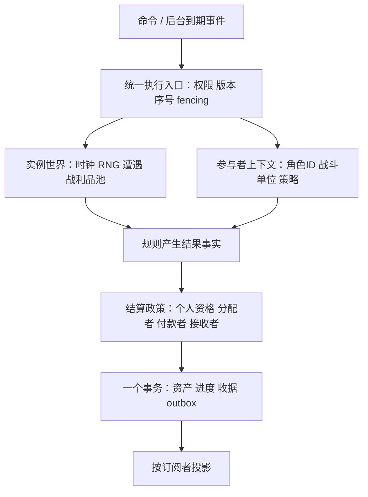

# 重构后的最终目标与架构复核

日期：2026-09-16。对象：当前工作区未提交的基础架构重构，Git 基线 `2a2157f`。本轮为架构复核，未修改产品实现、数据库或部署；探针只操作内存测试状态。

依据：[最终架构目标](2026-09-16-target-architecture-review.md)、[上线总规划](../plans/2026-09-16-launch-program/README.md)、[双类型队友设计](2026-09-16-companion-models-design.md)及当前源码。队友文档中已确认的产品要求与尚属建议的成长、费用和名额规则分别处理。

## 1. 结论

**技术方向合理，第一轮基础拆分有效，但当前架构尚未健康收口，不能认为原目标 A0—A5 已全部验收，也不适宜立即开始大规模铺世界和团本内容。**

应保留 Node 模块化服务、PostgreSQL、独立 worker、React/Pixi 和单一职业规则内核。下一轮投入应集中在三个方向：

1. 修复有明确复现的版本隔离、离线恢复、失败调度和物品身份问题。
2. 把共享实例从“队长完整角色 + 精简队员”改为共享世界状态与对等的参与角色上下文，使个人任务、补给、资产及奖励政策真正贯通。
3. 完成两名真人加 AI 通关死亡矿井的完整验收，再验证第二区域/副本的接入成本和真实 PostgreSQL 多进程负载。

上一轮“基础代码已落地”和“定向测试通过”仍然成立，但不等于最终产品架构已经全部完成。本轮发现了原测试未覆盖的路径，下面的未解决事项应成为新的收口清单。

## 2. 已成立、值得保留的边界

| 边界 | 当前证据与判断 |
| --- | --- |
| 账号与角色 | `accounts/characters/companions/parties` 分开，角色有稳定身份；队伍引用角色，不再由账号整档拥有所有状态 |
| 个人资产 | 钱包、物品实例及 owner、容器、账本独立；制造 actor/payer/recipient 有权限校验，绑定产物不能任意改收货人 |
| 经济事务 | 材料预留、资产变化、业务结算和 outbox 同事务；请求收据与业务唯一键分开，PostgreSQL 使用 SERIALIZABLE 和冲突重试 |
| 执行权 | 角色有唯一 actor lease；实例独立存储，worker 有 epoch fencing；关闭浏览器不再停止活动或副本 |
| 时间与随机 | 活动独立 RNG；专业和采集现实截止时间与模拟时间分别投影；组队时有显式时间重定位 |
| 客户端安全 | 服务端白名单投影隐藏随机种子、收据、执行租约及预生成遭遇；角色切换拒绝迟到响应 |
| 浏览器依赖 | 对实际 `app/game.tsx` 的静态、别名和动态导入闭包测试通过；浏览器不能到达 game-domain。几何、计量和展示辅助已从权威模块抽出 |
| 传输 | 静态目录按版本缓存，工坊只报价当前页；HTTP 条件请求、WebSocket 完整基线和增量事件均存在 |
| 技术复杂度 | 当前模块化单体加独立 worker 与项目规模相符；没有引入不必要的分布式平台 |

依赖探针扫描 83 个源模块、326 条运行时导入边，发现一组三模块循环：`class-mechanics → class-spell-effects → companion-combat → class-mechanics`。它是后续应拆解的局部规则依赖，不应把整个仓库描述为已失控的循环图。相反，跨浏览器/权威规则边界已经明显改善。

## 3. 必须先修复的已复现问题

优先级：P1 为恢复、数据完整性或最终多人模型的阻塞项；P2 为明确缺陷或应在相关能力扩展前完成的边界。

### R1 · P1：玩家命令可以绕过实例内容版本保护

`packages/game-domain/src/instances.ts:79` 的 `instanceCommand` 直接调用 `advance`；它没有 `startInstance` 和 `advanceInstance` 的内容版本检查。

复现：v1 服务创建两账号共享实例；换 v2 服务后，worker 正确返回“副本内容版本暂不可用”。随后访客通过 v2 发出 `settings` 命令，实例却成功推进至现实时间 61000、完成战斗并落账。

这表明“保存 contentVersion”还不是完整的执行边界。所有推进入口应经过同一版本解析、执行授权和提交检查。当前不要求多版本兼容；可以选择部署前排空活动或安全终止并退还预留，但必须一致拒绝混用规则。启动流程也应校验编译 manifest，不能只依赖开发者手动运行 `data:check`。

### R2 · P1：长离线追赶可能永远无法提交

`packages/game-domain/src/service.ts:68` 的个人上下文在 `advance(...).complete === false` 时直接抛错，事务随之回滚。`rules/engine.js:72` 的快速空闲路径明确排除了死亡角色等需要逐步处理的状态。

复现：合法死亡角色空闲离线一小时，连续两次 `revive` 都返回“离线活动仍在结算”；两次后 `wallAt` 仍为 1000。worker 找不到该角色的运行中活动，无法帮它追赶。不是“再点一次就能继续”，而是每次中间进度都被回滚。

应把有预算的追赶表示为可提交的进度，或持久调度为恢复任务。追赶未完成与业务失败必须区分，避免重试永远从同一位置开始。验收应覆盖死亡、宠物、持续效果等无法使用安静空闲快进的角色。

### R3 · P1：失败订单会占据全局到期批次

`service.ts:344` 固定取最老的 limit 条任务，异常路径 `service.ts:359` 只返回错误；没有持久尝试次数、退避、失败隔离或更新后的重试时间。`persistence/src/postgres.ts:48` 下一轮仍按原到期时间排序。

复现：一条最老的满包退款订单失败后，连续 `work(5000, 1)` 都只取它，后续健康订单始终未被选中。默认批次较大只提高触发所需的坏订单数，不消除问题。版本失配也能制造这种情况。

需要明确 `retryable / blocked / failed` 状态、`retryAt / attempts / lastError` 和公平领取策略。永久失败不应占满活跃队列；被阻塞的资产要有可恢复、可观察的处理方式。串行化事务保护原子性，不能代替任务调度的活性保证。

### R4 · P1：待领取工具丢失原资产身份和属性

`activities.ts:12` 在背包满时把原工具完整放到 pending；`rules/engine.js:179` 的领取逻辑却仅按模板 id/count 调用 `addItem`，重新生成物品。

复现完整流程：6339 工具原 UID 为 `rod`，携带 ownerId、locked、耐久 7、附魔 123。制造完成后进入 pending 时仍完整；腾出一格再领取，UID 变为新值、耐久变为 0，ownerId、locked、附魔消失。

“生成一件新掉落”与“移动一件已有物品”必须是不同操作。背包、装备、预留、待领取、银行等容器之间移动要保留同一 ItemInstance；需要所有容器往返的身份守恒测试，而非只验证最终模板数量。

### R5 · P2：满包退款没有完整的状态与交付路径

`activities.ts:103` 对工具使用 pending，对普通材料却直接 `receive`；制造产物发放也存在同类容量失败。

复现：A 付款、B 制造；预留腾出的 A 背包空位被后续物品填满。召回到期时报告储物空间不足，reservation 保持 reserved，B 的执行租约继续占用。A 清包后可以恢复，因此不是不可恢复的数据丢失；问题是系统没有明确表示“待领取/容量阻塞”，且该订单会触发 R3。

应统一退款和产物交付语义：选择有归属的待领取容器、显式容量阻塞或提前容量预留，并规定什么时候释放执行租约。UI 应显示恢复动作，而非长期停留在 returning。

### R6 · P2：免费创建伙伴会持续产生可变现资产

`service.ts:162` 免费创建伙伴，`rules/character.js:117` 发放未标记为保障物资的起始物品，出售路径接受它们。

无需注入测试状态：连续创建两名法师伙伴，各卖起始奶酪，分别净得 4 铜，起始水还可以出售。伙伴钱包可以充当制造付款人，收益并非完全隔离。金额小不改变边界问题。

应定义免费保障物资的身份、可转移/出售/分解/任务用途，以及角色创建和工作位政策。这里不擅自把名册上限定为四人；限额与禁止免费资产变现是两个不同问题。

## 4. 最重要的模型缺口：实例参与者尚未对等

实例已从个人存档独立出来，但 `model.ts:72` 的 `simulation: Rules` 仍是一整份队长角色。`service.ts:61` 的 `member()` 删除非队长的 bag、money 等字段，`instances.ts:60` 用这种精简对象组装队员。

这已影响实际行为：

- **P1，个人进度/经济入口缺失。** 两账号都正常接取任务 7，同场击败狗头人。双方经验均从 40 到 65；队长的任务击杀变成 `{6:1}`，访客仍为 `{}`；当前金币和掉落也进入队长根对象。对应 `rules/combat.js:251`。并非要求简单地给每人复制金币或掉落，而是实例尚无显式的个人任务资格与战利品分配政策。
- **P2，访客恢复设置未被执行。** 访客把恢复阈值设为 1%，当前约 49% 生命，仍按队长 70% 阈值恢复，并消费队长食物 2070 从 4 到 3。`rules/recovery.js:30` 对所有成员读取根 settings/bag，访客自己的配置只被保存。当前也没有显式授权的共享补给预算。

因此，“两连接看到同一战斗”和“所有成员有永久角色行”只能证明共享执行基础成立，不能证明多人角色模型已经完成。

下一步应把现有模块内的逻辑职责调整为：

这些是现有模块化服务内的职责，不需要新增一组微服务。先贯通两名真人与 AI，再扩展团本；修复方案不能退化为对整个根状态反复换主角，也不能简单循环执行主角奖励逻辑。

## 5. 与最终目标的逐项差距

| 目标 | 当前状态 | 仍缺少的关键边界 |
| --- | --- | --- |
| A0 冻结模型与承载验证 | 部分完成 | 代码边界、SQL 与双连接原型已建立；真实 PostgreSQL 并发及完整模型验收未完成 |
| A1 多角色与经济事务 | 部分完成 | 角色资产、预留和个人专业已有；物品容器生命周期、统一制造 UI、免费保障资产政策待收口 |
| A2 并行活动与独立时间线 | 部分完成 | 独立后台活动成立；离线恢复、坏任务隔离、完整外派路线及共享资源裁决未完成 |
| A3 投影协议与静态内容 | 基础完成，规模验收未完成 | 隐私与依赖边界有效；动态响应仍重，浏览器使用 REST，手机/公网预算未验证 |
| A4 共享实例与佣兵 | 原型完成，目标切片未验收 | 两连接北郡遭遇不是两真人加 AI 通关死亡矿井；个人任务/补给/掉落、佣兵毕业配置、进度锁定待补 |
| A5 内容工厂与规模 | 未完成 | 新增一个复用怪物的遭遇注册项，不能证明第二完整区域/副本无需修改通用结构 |

其他具体差距：

- **采集资源是每角色副本。** `professions.js:34` 读取个人 resourceCooldowns，持久化到 Character.resourceReadyAt；没有资源刷新实例、共享采收记录或预约。与队友设计的“同一资源刷新实例只能采收一次”不一致。数据库扣材料原子性不能替代世界资源争用规则。
- **外派仍是当前地点动作链。** 没有持久的目的地、路线、目标数量/时长、寻找、等待刷新、预算、撤退与真实返程；召回固定三秒。独立活动调度是必要基础，尚不能称完整外派系统。
- **佣兵合同成立，模板强度未成立。** 当前三种注册模板以新角色初始装备为基础再改等级，不等于已确认需求中的“当前等级毕业配置”；收费冻结、合同唯一性与强度模板需分开验收。
- **任务资格不够完整。** 伙伴装备发放目前主要围绕同行成员和职业可穿戴条件，没有完整的个人任务前置、等级、阵营、完成轮次与特殊资格模型。是否让外派/替补共享里程碑仍应按已确认政策落地，不能把建议当成现有实现。
- **内容包仍主要是归档和指纹。** compiler 校验部分打包行宽并生成 SHA，但尚无完整跨引用校验、区域/副本分包及阶段编译。区域、资源、部分遭遇仍在代码中；`rulesetVersion/contentPhase/adaptationProfile` 没有独立表达。
- **接口类型尚浅。** `Rules = Record<string, any>`、`GameProps` 的 any、命令 `Record<string, any>` 和 player/view `JsonRecord` 仍普遍存在。响应校验只验证信封及对象类型，不能发现缺少 movement 等必需展示字段；命令也没有覆盖新领域动作的判别联合和运行时 schema。
- **outbox 是原语，不是消费闭环。** 事件与经济事务同写是正确的；外部 callback 与 inbox 分属事务，接收方仍需自己的原子 inbox+落账。至少一次重复回调是允许的语义。当前 worker 没有实际消费器，不能声称外部可靠交付已整体验收。
- **数据库约束尚不完整。** 实体行 + JSONB + SQL 索引合理，但必填归属、有效容器、装备槽唯一性及跨实体引用仍主要由领域代码维持。不要把当前 schema 描述为已覆盖全部资产不变量。

好友、公会、聊天、邮件、交易、全地图和完整团本属于产品功能缺口，不能仅因尚未实现就断言本次技术选型错误。但角色/奖励/资源这些前置模型必须在相应功能扩大前完成。

## 6. 容量与长期可维护性

当前固定角色动态响应约 408 KB，静态目录约 2.6 MB；未变更 HTTP 返回 304 是实质改善。但服务端计算 ETag 前已经组装了完整领域 snapshot；WebSocket 每连接定时读取，再生成完整投影后做 diff。增量传输省流量，不等于已避免重复数据库读取和视图计算。

本轮对 Store 调用做了只读计数，使用 5/40 个新角色同账号参加北郡遭遇，运行一次一秒推进：

| 席位 | character put | item put | wallet put | item list |
| --- | ---: | ---: | ---: | ---: |
| 5 | 5 | 40 | 5 | 9 |
| 40 | 40 | 320 | 40 | 79 |

这不是数据库吞吐测试，而是确认当前 `persistCharacter → persistAssets` 会重复写入每个成员的全部资产。上线更多实例前应支持未变更资产不写入、适当的模拟快照节奏、批量读取、按实例共享投影，以及历史活动/账本/outbox 的分页与保留策略。不能由“名册接受 40 人”推出“40 人实例已有容量保证”。

PGlite 测试真实执行 SQL、约束、事务和导出重载，但测试连接由串行队列包装；它不能证明外部 PostgreSQL 多连接竞争的表现。下一轮必须补真正的 API/worker 多进程抢占、失败接管、事务冲突及恢复验证，并记录实际负载预算。

## 7. 下一轮建议顺序与验收门槛

### 第一阶段：恢复和资产完整性

统一所有推进路径的版本检查；实现可提交的离线追赶；增加持久重试/阻塞状态；统一物品实例的容器移动与退款交付；禁止免费保障物资变现。

验收：旧版本命令和 worker 均不能推进；一小时死亡/带宠物离线可完成追赶并复活；队列存在坏订单时健康任务仍前进；满包退款可恢复且不丢资产；工具在 bag→reservation→pending→bag 往返中 UID、绑定、耐久、附魔不变。

### 第二阶段：完成多人纵向切片

建立对等参与者上下文、任务进度/领奖资格、战利品分配及补给付款政策。两名真人加长期伙伴/佣兵完成死亡矿井，覆盖掉落、任务、恢复、断线、服务重启、退出与合同终止；明确哪些动作由队长控制、哪些由角色拥有者控制。

验收应检查数据库中的实际个人进度、账本和物品 owner，而非只比对两边画面或 HTTP 状态。同时冻结佣兵模板与长期伙伴成长政策中尚属建议的部分。

### 第三阶段：活动、内容与规模收口

实现资源刷新实例与唯一采收；完整路线订单；编译阶段/引用校验；类型化命令和 DTO；真实数据库压力与失败恢复；第二完整区域/副本接入。达到这些门槛后再并发扩展全世界与首批团本内容。

## 8. 本轮验证记录

- 独立实例审查、独立经济审查，以及主审的依赖、协议、内容与写入路径复核。
- 主审重新运行 contracts、浏览器实际导入边界、persistence 和 game-server 定向测试：28/28 通过。
- 经济审查运行相关定向测试 31 项通过；实例审查运行 12 项通过。各组有重叠，不应相加宣传成唯一测试数。
- 只读探针复现 R1—R6、访客任务/补给差异，以及 5/40 席位写入次数。死亡/满包/工具属性使用合法持久状态 fixture；免费伙伴收益通过公开领域命令复现。探针在 `.cache/architecture-*-probe.*`，依赖图在 `.cache/architecture-graph.json`。
- 上一轮全量 648 项中 647 通过、1 项既有素材来源 SHA 失败，是当时集成记录；本轮未重复跑整套，未把它作为新发现不存在的证据。
- 本轮没有外部 PostgreSQL 并发测试、真机体验、完整双人死亡矿井流程或部署验收。

**最终判断：保留当前技术栈和已经建立的持久化/协议边界，先完成恢复可靠性与对等参与者模型。完成上述验收前，应将项目标记为“基础架构第二轮收口”，而不是“最终架构完成”。**
