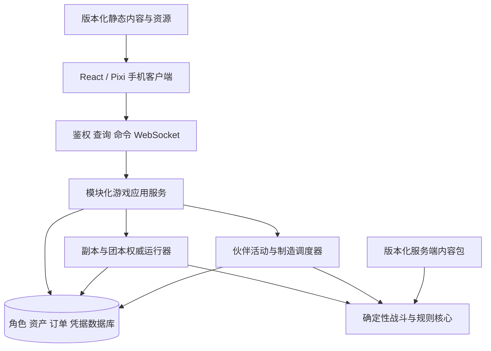

# 最终产品架构评估与调整建议

日期：2026-09-16。状态：基于当前源码的架构评估与目标设计建议，未实施。用户本次要求评估，不代表授权启动全部重构。

关联：[上线规划](../plans/2026-09-16-launch-program/README.md)、[队友设计](2026-09-16-companion-models-design.md)、[仓库开发指引](../../../AGENTS.md)。

## 1. 结论

需要在继续大规模添加世界内容和联机前，完成一次核心架构重构。重点是实体模型、活动执行、实例权威、经济事务和客户端协议。React/Pixi 表现、内容来源、职业规则及许多行为测试可以继续复用；不需要先改编程语言或建设复杂微服务平台。

当前结构适合“一个玩家存档，同时执行一项活动”的单人原型。最终产品需要“一个账号管理多名独立角色，多项后台活动并行，部分角色加入跨账号共享副本”。这是执行与所有权模型变化，不能只给原 `party[]` 加几个字段。

建议目标：**TypeScript 模块化游戏服务 + 独立活动/实例运行器 + 事务化资产存储 + React/Pixi 客户端 + 版本化内容包**。默认推荐 Node + PostgreSQL 承载游戏后端；已有 Sites 前端是否继续托管单独决定。Cloudflare Workers/Durable Objects 也是可行候选，需完成当前项目绑定、事务边界和运行成本验证后选择。

仓库 AGENTS.md 已明确：初期无需旧存档、旧接口或双版本兼容。新模型可直接替换旧模型，更新调用方、测试和文档并重建开发数据。不能为保留原型接口增加永久兼容层。未来正式发布后的保档要求需要另行明确，不在当前重构中提前实施。

## 2. 本次证据与测量边界

阅读的关键文件：

| 文件 | 观察 |
|---|---|
| `apps/web/db/schema.ts` | 主要是 `game_saves(user_id,state,revision)` 和命令收据，账号一行 JSON |
| `apps/web/app/api/game/route.ts` | 请求读取整份存档、调用引擎、整份保存；返回完整 `state` 和 `view` |
| `apps/web/lib/game/engine.js` | 主角对象兼作世界容器；一个 activity/combat/clock；100ms 步进；副本离线时直接跳过整个状态推进 |
| `apps/web/lib/game/session.js` | 一个浏览器 clientId 控制整份个人状态，副本推进依赖该控制页面心跳 |
| `apps/web/lib/game/character.js` | 主角固定 ID `player`、物品本地序号 `i1` 等、游戏 RNG 存于根状态 |
| `apps/web/lib/game/party.js` | 伙伴嵌在 party；没有独立永久名册与外派订单；招募物品池仍有低等级限制 |
| `apps/web/lib/game/professions.js` | 技能、地点、材料、收入和冷却均默认来自根状态 `s`；制造操作同步执行 |
| `apps/web/lib/game/quests.js` | 完成任务直接改主角金币/背包/经验，再更新一份 completed；未分离个人奖励资格 |
| `apps/web/lib/game/dungeon.js` | 死亡矿井专用入口、五人约束、`dm-N` 本地 runId；实例嵌在个人存档 |
| `apps/web/app/game.tsx` | 500ms/2500ms 轮询；大量 UI 直接读取权威内部 state，使用 any |
| `packages/sim-core/src/timeline.js` | 已有事件调度基础；本次在 `apps/web/lib` 检索未见 sim-core 引用，实际游戏使用另一个步进循环 |

本次内存探针：Node v24.11.1，新建 1 级法师，调用当前 `view()`，序列化为与 API 相同的 `{state,revision,view}` 结构。源码仍有其他任务在更新，因此是观察快照，不是冻结基准。

| 指标 | 结果 |
|---|---:|
| 角色原始 state | 2,032 bytes |
| view | 1,938,025 bytes |
| 完整响应 | 1,940,088 bytes，约 1.94 MB（十进制、未压缩） |
| recipes 字段 | 775,687 bytes；1,231 条 |
| items 字段 | 600,754 bytes |
| 连续 5 次 view() | 171.80、30.36、27.27、26.38、25.07 ms |

这不是云端吞吐、压缩后流量或手机性能测试。第一次包含懒初始化；样本过少，不能据此发布 p95。响应大小与源码路径足以证明静态数据在高频同步中重复携带，需要改协议；不能把 1.94 MB 的响应误称为接近 D1 行容量，因为当前实际存储 state 仅约 2 KB。

另一个源码推导：100ms 固定步进处理 24h 是 864,000 次 tick；默认单次 20,000 ticks 最多约 33 分 20 秒模拟时间，长离线需要多批追赶。这是迭代次数，不是实测 CPU 耗时。不能让所有空闲、采集和旅行角色都按同样频率空转。

## 3. 必须调整的八个边界

### A. 账号、角色、队伍、战斗单位分离

当前 `s` 同时表示主角、世界、钱包、背包、队伍和副本，`[s,...s.party]` 到处充当成员列表。主角独有的便利写法会让新角色专业、收益与任务逻辑继续泄漏到根状态。

目标模型：

- `Account`：认证身份、角色/伙伴名册、后台工作位、管理权限。
- `Character`：主角或长期伙伴的稳定 ID、等级、装备、技能、专业、个人资产归属与活动租约。
- `CompanionProfile`：长期伙伴身份、所属账号/主角、策略、成长政策；与出战状态分开。
- `MercenaryContract`：付费人、模板版本、报价、实例运行 ID、扣费与结束状态；不放进永久可交易资产名册。
- `Party/RaidRoster`：当前组织及成员席位，支持真人与 AI；只引用角色 ID，不拥有角色全部持久数据。
- `CombatUnit`：战斗中的角色/宠物/图腾/怪物投影，拥有本场 HP、光环、施法与威胁等状态。

所有 ID 在其需要的全局范围内唯一；宠物/临时召唤单位与角色持久 ID 分开。主角与伙伴共享角色能力模型，但通过控制者与成长政策体现差异，不复制两份职业代码。

### B. 单一 activity 改为每角色活动与后台订单

活动至少包含 `actorId/type/status/location/startedAt/settledUntil/nextEventAt/contentVersion/rngState`。采集订单另带资源路线、目标、背包/预算限制与返回状态；制造订单带执行者、配方、材料预留、产物接收者。

每个角色最多一个占用其执行权的活动。不同角色允许并行：主角打本、A 采矿、B 采药、C 制造。公共材料要先原子预留，不能 A/B 同时看到十个矿石都各用十个。

副本暂停只影响该实例，不能因为主角在副本且离线，就把留守伙伴的采集、制造和订单到期也暂停。召回是一种持久状态变化，已完成收益保留，返回路径结束后释放角色租约。

建议采用混合推进：战斗先保留当前可验证步长；旅行/采集/制造按到期事件推进，必要时用有上限的分段追赶。不要为了做统一调度一次性重写全部技能时序。

个人离线且不影响外部的活动可按需结算；会争用共享矿点、消耗共享材料、影响玩家交易的活动需要服务器主动调度或确定性资源预约，不能等玩家重新打开网页才决定谁先采到。首版采用持久到期队列与抢占租约，客户端仅订阅结果。

### C. 随机流与时间作用域分开

当前采集和战斗调用根 `rng(s)`。如果只添加多个活动数组，它们会争用同一随机流：增加一次采矿就可能改变下一次战斗暴击/掉落。

每个实例/独立活动保存自己的随机流及序列，创建时服务端分配种子，重试沿用原活动种子；不能取消重建活动免费重抽已经决定的奖励。共享资源争用由确定性的事件顺序与数据库约束裁决。

区分权威现实时间、实例模拟时间和结算游标。制造/佣兵合同/专业冷却按照其明确的现实时间规则；战斗施法/光环按照实例时间规则。避免“副本暂停六小时，采药和炼金冷却也停六小时”。具体战斗外 Buff/冷却仍需规则级定义，不能统一粗暴转换。

### D. 实例从个人存档中独立出来

真人队伍必须共同订阅同一个实例。每实例只有一个权威写入者，维护命令排序、成员控制权、随机状态、快照与事件序号。浏览器心跳代表连接状态，不作为其他成员和世界活动的总开关。

角色进入实例前结清个人活动、锁定本次参与资格并移交控制。实例内的战斗状态由实例执行者修改；装备/消耗品通过受约束的预留和结算流程进入，不能让个人接口同时改战斗中的同一份装备和资源。

实例执行者租约须含递增 epoch/fencing 标识；重启或接管后拒绝旧执行者继续写入。单进程可先简化部署，但仍测试只有一个有效写入者。持久化命令/关键事件与快照支持恢复；不要求把每个动画帧写数据库。

同一实例支持 5/10/20/40 人编组、真人/长期伙伴/佣兵控制器；首领脚本消费通用遭遇能力。不要给每个新副本复制一份 dungeon.js。

### E. 物品、金币、任务奖励与专业收益进入统一结算

资产存储必须明确：物品唯一 ID、ownerCharacterId、容器位置、绑定、来源；资金账户与账本；材料预留；操作幂等凭据。

同页展示/共用仓库是 UI 规则，不能抹掉个人所有权。制造订单可能由 A 支付、B 执行、C 接收可交易产物；技能与冷却属于 B，绑定产物仍受角色资格限制。过程应有明确的原子提交边界。

把任务“世界进度”和“每角色领取权”分开。个人装备奖励唯一键建议为任务实例/完成轮次 + 角色 ID + 奖励组；不能只用 `completed[questId]`，也不能把一次主角交任务直接循环执行五次金币和经验奖励。普通世界任务同步资格与角色限定任务分别评估。

佣兵扣费键绑定合同/实例，奖励键绑定 settlement/角色/奖励项；不能只依赖 HTTP requestId。后台重试可能是新请求，但仍对应同一个经济事实。

建议经济事务与 outbox 在同一次数据库事务写入；后台以至少一次投递配合幂等 inbox 落账。高频战斗事件和真实资产账本分开，不建设覆盖所有对象的全面事件溯源系统。

### F. 客户端只接收所需视图，静态数据独立缓存

当前完整 state 包含 rngState、内部流程、预生成副本信息等；继续原样用于多人协议会暴露不该公开的信息。目标 API 返回按身份/订阅范围筛选的 DTO，不返回权威内部对象。

按四类拆传输：

1. 启动信息：本人角色与名册摘要、订阅权限、版本。
2. 静态目录：物品说明、技能、配方、区域、图标，按 dataVersion 缓存/分页/分包。
3. 低频查询：工坊页面打开时读取所选角色、当前筛选配方的动态材料报价；订单/背包/市场查询按需分页。
4. 实时事件：血量、施法、状态、掉落通知、订单状态；发送增量，序列断档才补快照。

WebSocket 适合实时实例，REST 适合查询/命令和回退同步。不能只是把现在每次约 1.94 MB 的 JSON 换成 WebSocket 发送。客户端动画插值与服务器逻辑刷新解耦。

### G. 内容数据与通用规则分离

catalog 目前混合大型 JSON 合并、地点坐标、交通、队友/职业/专业依赖与诸多特例。全世界会增加修改热点和每次请求计算成本。

建立“原始来源 → 校验与转换 → 版本化内容包 → 运行时只读索引”。按区域、职业、实例和阶段编译，客户端只拿展示子集；来源资料与完整原始表留在工具/服务端。

任务、遭遇、资源、佣兵模板都使用稳定 ID 和已注册处理器。每个活动/实例固定内容版本，部署后不能让进行中的采集或首领突然切到另一份掉落/属性数据。

### H. 依赖与类型边界

新状态与协议使用 TypeScript 判别联合、运行时校验和显式返回值。先覆盖角色身份、活动、资产、命令、实例，不要求第一批把所有已有战斗文件机械改后缀。

拆分跨模块循环引用；规则层不依赖网页/数据库，内容包不直接改钱包，视图层不反向读取整个引擎状态。已有 UI 中 `combatMembers` 等辅助函数应按展示需要重新归类，防止表现组件捆绑服务端大目录。

## 4. 推荐技术结构



框图表示逻辑边界，不等于一开始部署七个微服务。推荐起步两个运行进程（API/实时实例与后台 worker）加一个事务数据库；两进程共用领域模块和事务实现。实例计算开始影响 API 延迟后，再将实例运行器单独扩容。

建议代码职责：

```text
apps/web/                 客户端和页面，托管方式可保留
apps/game-server/         鉴权、API、WebSocket、实例运行入口
apps/game-worker/         到期活动、制造/采集、恢复、outbox
packages/contracts/      命令、事件、DTO、运行时校验
packages/game-domain/    角色、队伍、任务、专业、合同、资产规则
packages/sim-core/       时间/随机基础与战斗模拟能力
packages/game-data/      编译后的版本化内容和索引
packages/persistence/    schema、事务、租约、凭据与存储实现
```

这是建议目录，不是当前已存在目录。可以把当前确定性职业/战斗规则放入上述边界，逐模块同步改调用方。不要复制出“新旧两个引擎”长期并存。

### 存储实体的最小集合

| 组 | 实体 | 强一致约束 |
|---|---|---|
| 身份 | accounts、characters、companion_profiles | 账号权限、角色稳定 ID、名册与当前队伍分离 |
| 专业 | character_professions、recipe_unlocks、profession_cooldowns | 每角色双主要专业、合法技能/专精、重招不清冷却 |
| 资产 | containers、item_instances、wallets、asset_ledger、reservations | 物品唯一归属、不可负余额、共享材料不能双花 |
| 活动 | activities、work_orders、actor_leases | 每角色唯一活动租约、进本/采集/制造互斥 |
| 任务 | adventure_progress、character_reward_claims | 世界进度共享与个人领奖分开 |
| 实例 | parties、instance_runs、rosters、snapshots、raid_locks | 单实例权威写入、锁定和恢复 |
| 合同 | mercenary_contracts | 报价冻结、同一合同只扣费一次 |
| 可靠交付 | command_receipts、settlements、outbox、inbox | 请求重试与业务结算分别去重 |

名字只定义职责，不要求机械建成二十张独立表。对战斗光环、策略、一次实例快照继续使用 JSON 是合理的；可交易资产、可检索活动、所有权和并发约束应结构化。

## 5. 平台选择

| 方案 | 适用性 | 成本/约束 | 建议 |
|---|---|---|---|
| 现有 Sites + 单 D1 玩家 JSON + 请求推进 | 当前个人原型 | 缺共享实例、独立活动与跨角色资产边界 | 不作为最终后端形态 |
| Workers + Durable Objects + 结构化 D1/对象存储 | 有状态实例与定时活动可以实现 | 必须验证 Sites 绑定/部署能力，设计跨对象经济一致性和资源调度 | 可选，适合明确希望留在 Cloudflare 的情况 |
| Node/TypeScript + PostgreSQL + worker + WebSocket | 统一角色/资产事务，后台活动与实例易集中治理 | 需要后端部署、进程监控、备份与容量管理 | 最终产品默认推荐 |

理由是本项目正在增加大量跨角色资产、个人专业、异步订单与跨账号副本关系，事务数据库有利于把它们放在清楚的提交边界中。[PostgreSQL 事务文档](https://www.postgresql.org/docs/current/tutorial-transactions.html)说明多步修改可以以原子方式提交；业务仍必须正确实现权限、锁、约束及幂等，换数据库不会自动修复规则。

D1 不是不能做多人游戏。官方说明单数据库查询串行执行、按多个较小数据库横向扩展；当前单 DB 高频整档写入需要重新设计并压测。[D1 限制](https://developers.cloudflare.com/d1/platform/limits/)不能用来直接推出本项目的实际在线人数上限。

Durable Objects 提供[WebSocket 支持](https://developers.cloudflare.com/durable-objects/best-practices/websockets/)和[定时唤醒](https://developers.cloudflare.com/durable-objects/api/alarms/)；alarm 为至少一次执行，单对象同一时刻设置一个 alarm，可自行维护多个到期事件。它能承载本方案的部分执行职责，但不能免掉去重、调度、跨角色事务和故障恢复设计。

不建议首版同时加入 Redis、Kafka、Kubernetes、分布式 ECS 等全部基础设施。先让数据库持久队列/租约与单实例执行模型闭环；观测显示瓶颈后再引入专门队列或缓存。无需换成 Unity/3D 引擎，也无需为了采集增加实时大模型调用，伙伴策略继续使用确定性规则。

身份也要解耦：当前读取 Sites 注入的 ChatGPT 身份请求头，只在可信入口配置正确时成立；不能直接搬到可被公众任意传头的 Node 服务。游戏角色只依赖内部 accountId，新部署须验证登录凭据并在边缘清除伪造身份头，登录渠道另行选定。

## 6. 重构范围与保留价值

| 内容 | 处理方式 |
|---|---|
| 人物身份、名册、专业、活动、资产与存档 schema | 重新建模，旧开发档可失效；无需迁移/旧字段别名 |
| engine 根状态、session 控制、API、个人副本存档 | 重构；当前大部分调用方需要同步修改 |
| 游戏循环 | 保留已验证战斗规则，重做运行上下文与多活动调度 |
| UI 状态管理/接口 | 重构为按角色/活动/实例订阅的类型化视图 |
| React/Pixi 组件、布局、素材映射 | 复用，更新数据输入和多人展示 |
| 职业技能/天赋/公式、任务/副本资料、导入脚本 | 审核后复用，调整上下文和内容包接口 |
| 行为测试/正常旅程脚本 | 保留业务意图与黄金数值，改新结构；只为旧存档兼容而存在的测试可删除 |
| 旧版 catalog/API 兼容桥 | 不建设；替换旧实现并同步更新消费者 |

无法仅凭行数给出“重写百分比”。跨模块调用改动会较广，但公式、效果、内容和视觉工作并未失去价值。主要投入是让已实现能力运行在最终产品要求的身份、时间和所有权模型下。

## 7. 推荐执行顺序与验证门槛

### A0：收口与设计冻结

收口当前职业/专业任务，保留可追踪源码快照；形成新模型、权威边界与协议。旧模型中的数值/机制测试作为业务参考，不承诺旧 API 或旧存档继续运行。

确定平台方案前做承载原型，测两连接实时实例、定时任务重启、事务扣料/发奖与基本开销。平台选择不能阻塞角色/活动纯模型设计，但确定数据库后再编写最终持久化实现。

### A1：多角色与经济事务

主角 + 两名长期伙伴，各自专业/背包/余额，共用工坊。任务一次操作给每个合法角色发一份装备；并发订单竞争同一批材料必须原子拒绝或正确排队。

### A2：并行活动与独立时间线

主角战斗、伙伴采矿、伙伴制造同时执行。测试关网页、离线追赶、服务重启、重复执行、召回与进本冲突；采集变化不能改变已固定种子的战斗结果。

### A3：新客户端协议与静态内容

新角色启动、工坊、背包、战场只加载所需数据；不再返回整份内部 state，静态目录缓存复用。记录实际字节数、生成时间及真机表现，再定发布预算。

### A4：共享实例与佣兵合同

两真人 + 长期伙伴/佣兵完成死亡矿井：同一战斗视图、不同控制权限、断线重连、单次合同扣费、单次奖励落账。用小真实副本验证结构后，再测试 40 人合成/真实连接场景。

### A5：内容工厂与规模验证

把第二个区域和第二个副本接入，证明不需再修改通用角色/账本/引擎结构。随后才并发铺全世界和后续团本。

不建议在现有单状态模型上先实现完双队友、外派采集和全职业个人专业，再另做重构，那会让新玩法也绑定到将被替换的结构。内容来源整理、技能正确性补证、素材和独立视觉组件可以继续。

## 8. AI 并发方式与估算

模型冻结前一个负责人处理领域/协议，其他任务只做数据、测试夹具和平台实验。冻结后分成三线：领域/模拟，持久化/运行器，客户端/数据投影；集成人员唯一负责公共契约和 schema。

每条线消费同一套契约样例，单任务工作区隔离。重构分批交付完整新功能切片，旧接口在对应切片替换时删除，不要求在同一部署中双版本运行。

本次不提供未经任务分解/测量的重构工期。上一版 20—32 周属于旧工作拆分的预算情景；须把此处 A0—A5纳入并重新估计。最终是否保留 Cloudflare、部署地区与规模、活动工作位等仍会影响工期与成本。

## 9. 本次未验证事项

- 没有改动游戏代码、数据库、登录或部署，没有清档。
- 没有本次全量测试/构建/云压测，不复用前轮 407 项测试结论作为当前版本状态。
- 字节数与时间来自本地内存探针，没有浏览器网络压缩、跨地区延迟或生产负载证据。
- 架构缺口由源码与最终玩法需求对照得出；Node/PostgreSQL 是推荐，不是已完成的平台选型或性能认证。
